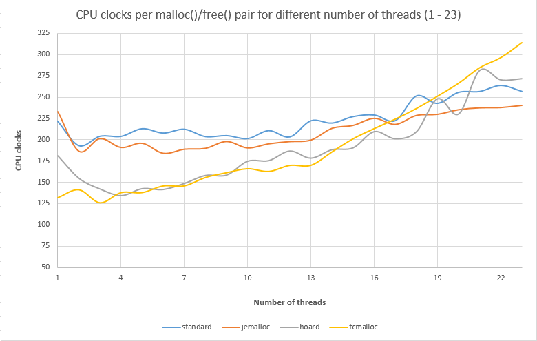
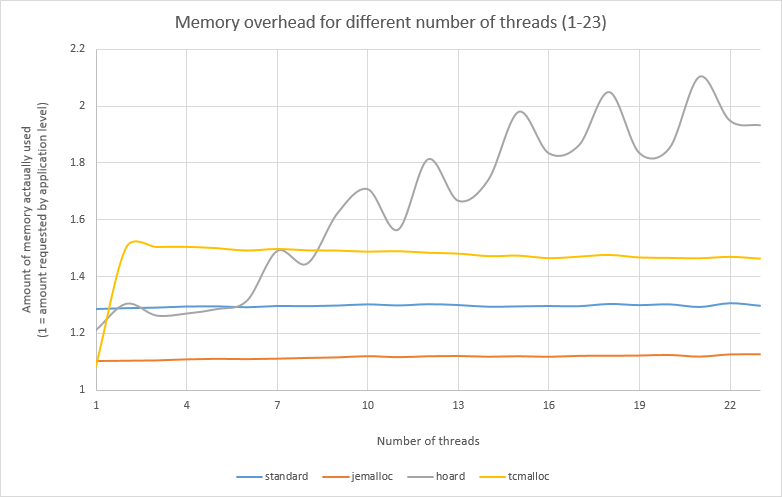

很多软件，我们没有必要对其内存使用进行优化。这是因为有些软件的内存消耗非常的小，不值得再继续优化；
有些软件虽然开销很大，但是对于业务运行没有影响，因此也就没有必要(动力)优化。

我们需要执行优化，很多时候是使用（测试/压测）过程发现了问题。软件还是那个软件，但是因为使用的场景变化了，
新的问题就出现了。比如个人使用 OpenResty 做反向代理来管理自己的几个小站点，这个时候就不容易出问题。如果是
企业使用，这时候可能会有成千上万个站点；这种情况下内存，CPU 的开销就变大了，因此优化效果也就比较可观。

前面唠叨了那么多，我们下面重点讲一讲怎么选择内存分配器。 Linux 上， 个人常见的 内存分配器有 Glibc 自带的 ptmalloc，以及
Google 出品的 TCmalloc 和 Facebook 出品的 [Jemalloc](https://github.com/jemalloc/jemalloc)。Google的 TCmalloc 分成[开源](https://github.com/gperftools/gperftools) 和 [内部](https://github.com/google/tcmalloc) 两个版本。另外还有一个 hoard 内存分配器个人则不太了解，不过看其github的提交记录，2020年8月之后就没有更新了。

可以从这个 [链接](http://ithare.com/testing-memory-allocators-ptmalloc2-tcmalloc-hoard-jemalloc-while-trying-to-simulate-real-world-loads/)
了解到各个内存分配器的性能测试数据。

从这边可以看到，标准的 Glibc 自带的内存分配器的分配性能基本上是最差的，但是在单线程的情况下反而比 jemalloc 要来的好。tcmalloc 的分配性能在 17 线程以下都比 jemalloc 和 Glibc 自带的内存分配器来得好。

从图中可以看到，jemalloc 的内存额外开销是最小的， tcmalloc 会比 jemalloc 高出 50%。

我们翻译一下他给出的结论：

1. 在没有指定确切的应用程序的情况下，我们测试的现代内存分配器彼此之间相差并不太大。更重要的是，它们中的每一个都可以在特定条件下胜过另一个。换句话说:如果你确实想通过更改内存分配器来获得性能提升，请确保用自己的应用程序测试它们。
2. 如果我们不知道一个确切的应用程序，那么我们的建议如下:
    - 考虑到奇怪的内存开销，尽量不选 hoard 内存分配器
    - tcmalloc和ptmalloc2非常相似(在这一点上，似乎 tcmalloc 对台式机有优势，而ptmalloc2 -对服务器有优势，但现在下结论还为时过早)
    - 但在我们看来，目前为止的总冠军是 jemalloc。它的低内存开销有望改善缓存的处理方式，对于一个“普通的应用程序”，我们希望它的性能至少不会比其他应用程序差。

所以，如果我们想对应用的内存分配进行优化，还是得结合实际的应用进行测试。并且这个测试应该贴近实际使用，而不是为了得到好看的数字。
当然这里说的实际使用不是指多数情况下软件运行的基本状态，应该是各种情形都需要测试。比如网络连接数变化，传输文件大小变化，网络带宽变化等各种情况。因为正在运行的软件多数情况下是没有问题的，否则也不应该上线。

因为上面介绍的主要是内存的分配和释放，其实还有一点很重要：是否能够把内存及时归还给操作系统。
比如升级软件的时候，为了实现平滑过渡，新旧进程同时存在，如果旧进程不能够及时把内存归还给操作系统，那么就会造成 2 倍的内存开销。在内存不足时，操作系统的 OOM killer 开始工作就会把内存占用最大的进程给杀死（不确切，是打分机制，暂且这么理解），这时候也就达不到平滑过渡的效果。

各种分配器为了提升分配性能，都有各种各样的缓存机制，从操作系统申请的内存页面多数情况下都不会及时归还给操作系统。Glibc 为此提供了一个 `int malloc_trim(size_t pad)` 的接口来实现将 heap 顶端的空闲内存归还给操作系统。
但是由于 sbrk 内存分配的特性，malloc_trim 的效果并不是大多数人想的将空闲内存都归还给操作系统，这个得用另外的文章来介绍 sbrk 的内存分配才能深入的理解。jemalloc 和 tcmalloc 不使用 sbrk 方式分配内存，在归还内存给操作系统方面相对来说会好得多，但是因为缓存机制，内存碎片的原因，什么时候归还给操作系统也不确定。

因此，对于内存分配器的选择，我的建议是：

1. 首先确认是否有必要进行内存优化
2. 确认内存优化的目标：是提升分配的速度还是降低内存额外开销
3. 设计测试场景，覆盖常用情况和极端情况
4. 使用各种内存分配器对内存分配进行测试
